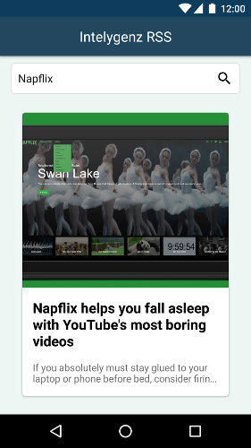
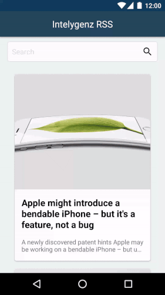

Introduction
------------

This is the solution to the Intelygenz RSS challenge. To resolve it I decided to use as the base of my architecture the [Clean Architecture][clean], splitting the project into 3 different layers:

* **Presentation**: That contains all the presentation logic. Following the [MVP][mvp] pattern, I use **views** to control all actions related to the UI/UX while the **presenters** will manage all the logic based on the user's actions.
* **Domain**: It manages all the business logic of the app. In the middle between the UI/UX and the backend.
* **Data**: This layer is in charge of the external communications. In this case I decided to feed the data from the [News API][newsapi] site, so I used a **net** layer for that. Using [Retrofit 2][retrofit2] as library to make the necessary RESTFull calls. Additionally the app saves the result in local DB [SQLite][sqlite] to be shown if there are network problems.

UX
--
The main screen of the app will list the most recent news from News API.

It is also possible to make a search over the title of the new.

The app will show the details of the news in a separate screen.

In case you want to change the source of the data, you can configure it in the Settings section (from the drawer in the main screen):

The flow could be like this

Testing
-------
I also provide a sample battery of JUnit test. This architecture is in deep used to facilitate unit testing and CI. [JUnit][junit] and [Mockito][mockito] are the libraries used to accomplish this task. It tests:

* **Presenters**: In order to test that all presentation logic works as expected.
* **Interactors**: To test the connection between **Presentation** and **Data** layers.
* **Repositories**: So we can check all resources cases (**net flow** is there is internet connection or **DB flow** otherwise).
* **Others**: Like Utils and Mappers. 

Libraries used in this project
------------------------------
* [Retrofit 2] [retrofit2]
* [Dagger 2] [dagger2]
* [JUnit] [junit]
* [Mockito] [mockito]
* [Picasso] [picasso]
* [Butterknife] [butterknife]
* [SQLite] [sqlite]

License
-------

    Copyright 2015 Karumi

    Licensed under the Apache License, Version 2.0 (the "License");
    you may not use this file except in compliance with the License.
    You may obtain a copy of the License at

       http://www.apache.org/licenses/LICENSE-2.0

    Unless required by applicable law or agreed to in writing, software
    distributed under the License is distributed on an "AS IS" BASIS,
    WITHOUT WARRANTIES OR CONDITIONS OF ANY KIND, either express or implied.
    See the License for the specific language governing permissions and
    limitations under the License.

[clean]: https://blog.8thlight.com/uncle-bob/2012/08/13/the-clean-architecture.html
[mvp]: http://martinfowler.com/eaaDev/uiArchs.html#Model-view-presentermvp
[newsapi]: https://newsapi.org/
[sqlite]: https://sqlite.org/
[retrofit2]: http://square.github.io/retrofit/
[dagger2]: https://google.github.io/dagger/
[junit]: https://github.com/junit-team/junit
[mockito]: http://mockito.org/
[picasso]: http://square.github.io/picasso/
[butterknife]: http://jakewharton.github.io/butterknife/
